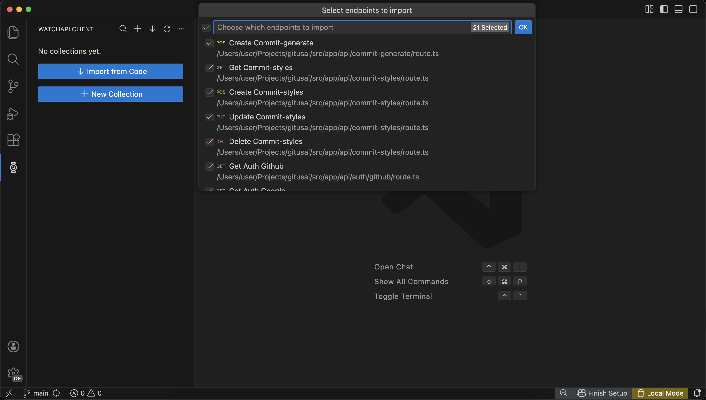

# WatchAPI - REST Client & API Testing

**An API client that reads your code.** Auto-import endpoints from Next.js, NestJS & tRPC. Test and monitor without leaving VS Code.

## Why WatchAPI?

**Stop manually recreating API routes by hand.** WatchAPI auto-discovers endpoints directly from your codebase.

- One click imports all Next.js/NestJS/tRPC routes
- Test requests inside VS Code (no context switching)
- Share collections with your team
- Monitor production uptime and performance

**Free for individuals. Team features available.**

## Features

### Free Forever (Individual Use)

**Auto-Import from Code** - Skip manual setup. Automatically detect API endpoints from:

- **Next.js** - App Router & Pages Router routes
- **NestJS** - Controllers and decorators
- **tRPC** - Router definitions

**Full REST Client**

- Execute HTTP requests (GET, POST, PUT, PATCH, DELETE, HEAD, OPTIONS)
- View response status, headers, and body inline
- Organize endpoints in collections
- Full request customization (headers, body, query params)
- Works 100% offline, no account required
- Local-first storage on your machine

### Team Features (Cloud)

**Collaboration**

- Cloud sync across devices
- Share collections with teammates
- Real-time updates
- Team workspaces

**Monitoring & Alerts**

- Production endpoint health checks
- Uptime tracking and dashboards
- Response time analytics
- Slack/Discord/email notifications
- Custom alert rules

## Quick Start

1. Install the extension from the VS Code Marketplace
2. Click the WatchAPI icon in the activity bar
3. **Pull from Code:** Auto-detect all Next.js/NestJS/tRPC endpoints (recommended)
4. **Or create manually:** Click "New Collection" to add endpoints by hand
5. Click any endpoint to execute and view the response

Works offline by default. Sign in optional (enables team features).

## Comparison

| Feature                    | WatchAPI | Postman | Thunder Client | REST Client |
| -------------------------- | -------- | ------- | -------------- | ----------- |
| Auto-Import Next.js/NestJS | ✓        | ✗       | ✗              | ✗           |
| Native VS Code Extension   | ✓        | ✗       | ✓              | ✓           |
| GUI + Collections          | ✓        | ✓       | ✓              | ✗           |
| Team Collaboration         | ✓        | ✓       | ✓              | ✗           |
| Production Monitoring      | ✓        | ✓       | ✗              | ✗           |
| Free Tier                  | ✓        | Limited | ✓              | ✓           |
| Works Offline              | ✓        | Limited | ✓              | ✓           |

## Privacy & Data

**Local-First Design:**

- All collections stored on your machine by default
- No telemetry or usage tracking
- Optional cloud sync (only when signed in)
- Open source support repo

Privacy Policy: [https://watchapi.dev/privacy](https://watchapi.dev/privacy)

## Support

- **Report Issues:** [GitHub Issues](https://github.com/watchapi/watchapi-client-support/issues/new)
- **Documentation:** [docs.watchapi.dev](https://docs.watchapi.dev)
- **Website:** [watchapi.dev](https://watchapi.dev)

---

**Built by developers who test APIs where they write code.**
