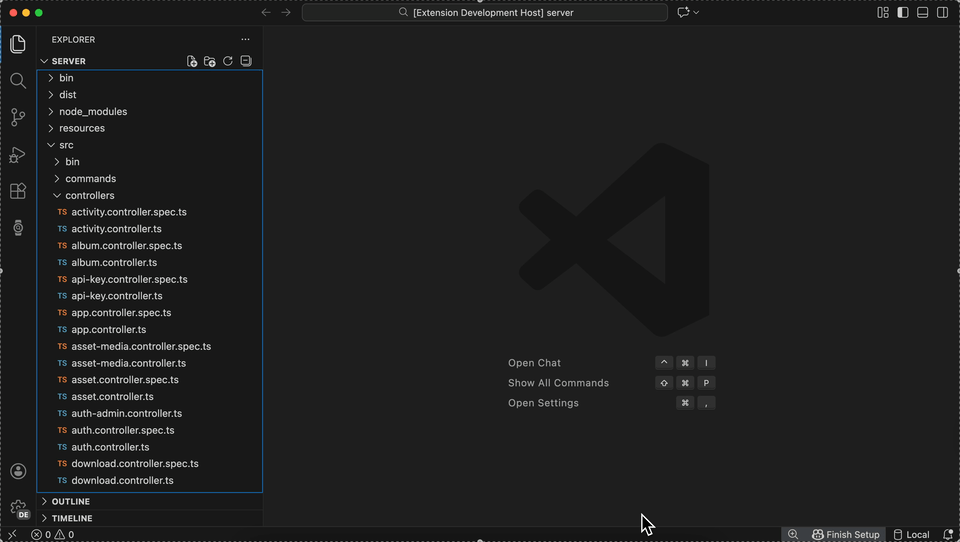

# WatchAPI - REST Client & API Testing

**An API client that reads your code.** Auto-import endpoints from Next.js, NestJS & tRPC. Test and monitor without leaving VS Code.

## Why WatchAPI?

**No need manually recreating APIs** WatchAPI analyzes your code and extracts endpoints directly.

- One click imports all Next.js/NestJS/tRPC routes
- Test requests inside VS Code (no context switching)
- Share collections with your team
- Monitor production uptime and performance

## Features

**Auto-Import from Code** - Skip manual setup. Automatically detect API endpoints from:

- **Next.js** - App Router & Pages Router routes
- **NestJS** - Controllers and decorators
- **tRPC** - Router definitions

**Full REST Client**

- Execute HTTP requests
- View response status, headers, and body inline
- Organize endpoints in collections
- Full request customization (headers, body, query params)
- Works offline, no account required
- Local-first storage on your machine

### Team Features (Cloud)

**Collaboration**

- Cloud sync across devices
- Share collections with teammates
- Real-time updates
- Team workspaces

**Monitoring & Alerts**

- Production endpoint health checks
- Uptime tracking and dashboards
- Response time analytics
- Slack/Discord/email notifications
- Custom alert rules

## Quick Start

1. Install the extension: [Marketplace](https://marketplace.visualstudio.com/items?itemName=WatchAPI.watchapi-client) or [Open VSX](https://open-vsx.org/extension/watchapi/watchapi-client)
2. Click the 'watch' icon in the activity bar
3. **Pull from Code:** Auto-detect all Next.js/NestJS/tRPC endpoints (recommended)
4. **Or create manually:** Click '+ New Collection' to add endpoints by hand
5. Navigate and open requests to execute: 'Send Request'

Works locally by default. Sign in optional (enables team features).

## Comparison

| Feature                    | WatchAPI | Postman | Thunder Client | REST Client |
| -------------------------- | -------- | ------- | -------------- | ----------- |
| Auto-Import Next.js/NestJS | ✓        | ✗       | ✗              | ✗           |
| Native VS Code Extension   | ✓        | ✗       | ✓              | ✓           |
| Team Collaboration         | ✓        | ✓       | Paid / Limited | ✗           |
| Production Monitoring      | ✓        | ✓       | ✗              | ✗           |
| Free Tier                  | ✓        | Limited | ✓              | ✓           |
| Works Offline              | ✓        | Limited | ✓              | ✓           |

## Privacy & Data

**Local-First & Open Source:**

- All collections stored on your machine by default
- No telemetry or usage tracking
- Optional cloud sync (only when signed in)
- **Open source** under MIT license

Privacy Policy: [https://watchapi.dev/privacy](https://watchapi.dev/privacy)

## Contributing

Welcome, lets collaborate:

- **Read the [Contributing Guide](CONTRIBUTING.md)** to get started
- **Report bugs** via [GitHub Issues](https://github.com/watchapi/watchapi-vscode/issues)
- **Request features** via [GitHub Discussions](https://github.com/watchapi/watchapi-vscode/discussions)
- **Submit PRs** - we review and merge regularly
- **Review the [Code of Conduct](CODE_OF_CONDUCT.md)** before contributing

See [SECURITY.md](SECURITY.md) for reporting security vulnerabilities.

## Support

- **Report Issues:** [GitHub Issues](https://github.com/watchapi/watchapi-vscode/issues)
- **Discussions:** [GitHub Discussions](https://github.com/watchapi/watchapi-vscode/discussions)
- **Documentation:** [docs.watchapi.dev](https://docs.watchapi.dev)
- **Website:** [watchapi.dev](https://watchapi.dev)

## License

This project is under the [MIT License](LICENSE).

---

**Let your code define the testing workflow**
