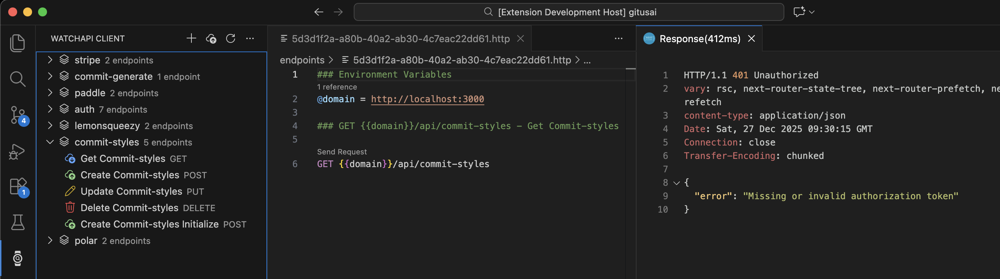

# WatchAPI Client

WatchAPI Client is a REST client for testing and managing API endpoints directly from VS Code.
It lets you organize endpoints into collections, send HTTP requests, and work with APIs without leaving your editor.

## Features

- **Local-First**: Works completely offline - all data stored locally in VS Code
- **Collections Management**: Create and organize API endpoints into collections
- **HTTP Requests**: Send requests with full support for GET, POST, PUT, PATCH, DELETE, HEAD, and OPTIONS methods
- **Response Viewer**: View and inspect API responses directly in VS Code
- **Optional Cloud Sync**: Login to sync collections across devices and collaborate with teams
- **Organization Support**: Switch between multiple organizations when logged in
- **Bulk Operations**: Upload multiple endpoints at once
- **Dashboard Integration**: Quick access to your WatchAPI dashboard (when logged in)

## Quick Start

1. Install the extension
2. Open the WatchAPI activity view in VS Code
3. Create a collection and add endpoints
4. Send requests and inspect responses
5. **(Optional)** Login to sync your data across devices or collaborate with teams

## Privacy & Security

- **Local-First Storage**: All collections and endpoints are stored locally in VS Code by default
- **Optional Cloud Sync**: Login only if you want to sync data across devices or collaborate with teams
- **No Tracking**: We don't collect analytics or usage data from the VS Code extension
- **Your Data, Your Control**: Data stays on your machine unless you explicitly choose to sync it

You can review the full Privacy Policy at https://watchapi.dev/privacy

## Need Help?

Something broken? [Open an issue](https://github.com/watchapi/watchapi-client/issues/new) or check out [WatchAPI](https://watchapi.dev).

---

Built by developers who prefer working with APIs directly from their editor.
